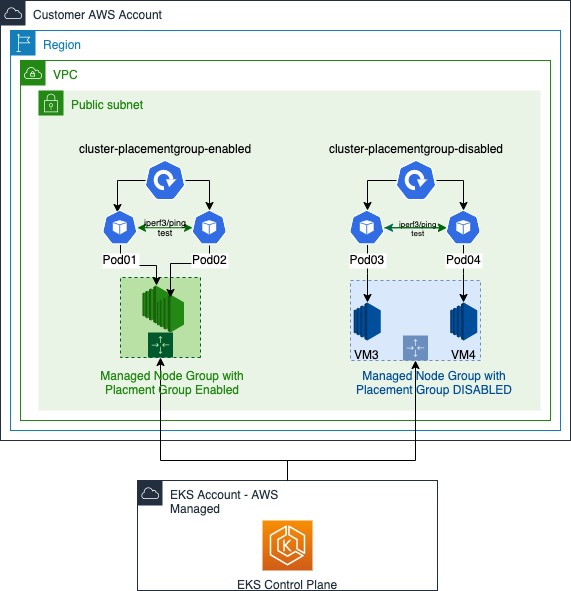

# EKS Managed Node Groups with Placement Group

This is the code for the blog post: How to leverage AWS Amazon Elastic Kubernetes Service (EKS) Managed Node Group with Placement Group for low latency critical applications.

Please refer to the below two documents for cdk code and terraform code:

- [CDK](./cdk/README.md)
- [Terraform](./terraform/README.md)

## Solution Overview

In this repository, we create an Amazon EKS cluster with two managed node groups (One with Placement Group Enabled, and the other without Placement Group Enabled), each node group contains two c5.large instances. The EKS cluster is attached to a newly created VPC. All application workloads are running in the VPC’s public subnets for demo purposes. When you create a new cluster, Amazon EKS creates an endpoint for the managed Kubernetes API server that you use to communicate with your cluster. For your convenience, in this blog, we make such Amazon EKS cluster’s Kubernetes API server endpoint public, so that it’s easier for you to validate the solution in your AWS accounts.

In the performance testings, we create two [iperf3](https://hub.docker.com/r/networkstatic/iperf3) deployments in two different node groups and test the throughput and latency performance between the two nodes within the same node group. The following diagram shows the high-level architecture.

As shown in the above diagram, pod01 and pod02 are created under deployment `cluster-placementgroup-enabled`, and they are hosted on the two nodes with Placement Group **enabled** accordingly. Pod03 and pod04 are created under deployment `cluster-placementgroup-disabled`, and they are hosted on the two nodes (VM3, VM4) with Placement Group **disabled** accordingly. The performance testings (iperf3 and ping) occurred between pod01 & pod02, and pod03 & pod04 accordingly.

## Security

See [CONTRIBUTING](CONTRIBUTING.md#security-issue-notifications) for more information.

## License

This library is licensed under the MIT-0 License. See the LICENSE file.
