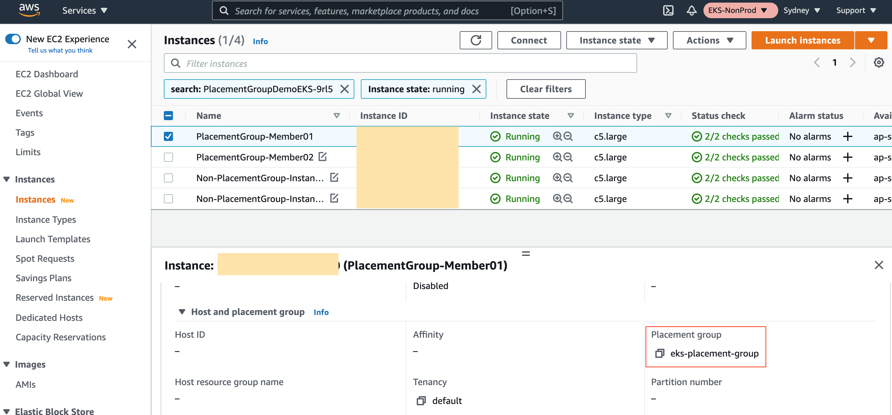
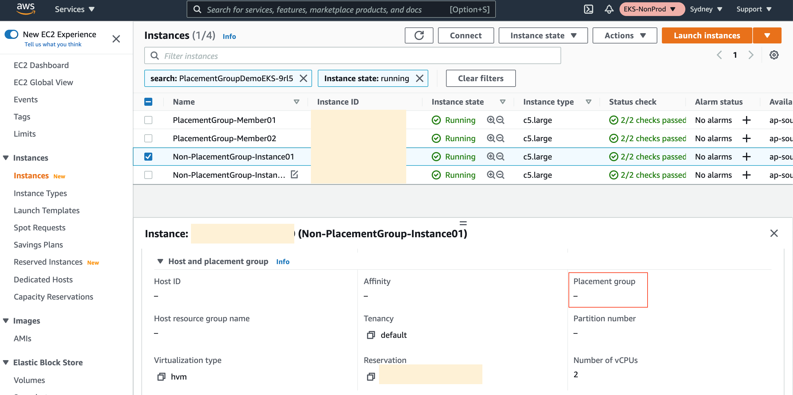

# eks managed group placement group

This repository is to create an EKS cluster with two managed node groups: one with a placementgroup launch template, and the other without placementgroup with newly a created VPC with CIDR range 10.192.0.0/16 with 3 public subnets. Both EKS managed node groups are properly labelled. 

Note: this is prototype-quality code intended to demonstrate performance on an EKS cluster using node placement groups.   
This terraform is not suited for production use.

## How to create the cluster

This cluster comes with a VPC to ensure a stable, testable experience.   Typically the VPC will be defined in a separate terraform
workspace, it is combined in this case to make installation easier.

https://aws-ia.github.io/terraform-aws-eks-blueprints/#terraform-caveats


### Perform terraform init

```bash
$ terraform init
Initializing modules...

Initializing the backend...

Initializing provider plugins...
- Reusing previous version of hashicorp/tls from the dependency lock file
- Reusing previous version of hashicorp/cloudinit from the dependency lock file
- Reusing previous version of hashicorp/aws from the dependency lock file
- Reusing previous version of hashicorp/random from the dependency lock file
- Reusing previous version of hashicorp/local from the dependency lock file
- Reusing previous version of hashicorp/null from the dependency lock file
- Reusing previous version of hashicorp/kubernetes from the dependency lock file
- Reusing previous version of hashicorp/time from the dependency lock file
- Using previously-installed hashicorp/local v2.1.0
- Using previously-installed hashicorp/null v3.1.0
- Using previously-installed hashicorp/kubernetes v2.10.0
- Using previously-installed hashicorp/time v0.9.1
- Using previously-installed hashicorp/tls v4.0.4
- Using previously-installed hashicorp/cloudinit v2.3.2
- Using previously-installed hashicorp/aws v4.57.0
- Using previously-installed hashicorp/random v3.1.0

Terraform has been successfully initialized!

You may now begin working with Terraform. Try running "terraform plan" to see
any changes that are required for your infrastructure. All Terraform commands
should now work.

If you ever set or change modules or backend configuration for Terraform,
rerun this command to reinitialize your working directory. If you forget, other
commands will detect it and remind you to do so if necessary.
```

### Deploy the Terraform 
Apply the vpc module first, then the rest

```bash
$ terraform apply -target="module.vpc"
$ terraform apply 
```

### Update the kubeconfig

```bash
aws sts get-caller-identity
aws eks update-kubeconfig --region us-west-2 --name PlacementGroupDemoEKS-QKyW
```

### Check the Kubectl Nodes

* From the output, we see two nodes do not have placement group set up and are in ap-southeast-2a, while the ones with placement group are both in ap-southeast-2c

```bash
$ kubectl get nodes -l placementGroup=true
NAME                                             STATUS   ROLES    AGE    VERSION
ip-10-128-6-85.ap-southeast-2.compute.internal   Ready    <none>   152m   v1.21.2-eks-55daa9d
ip-10-128-6-88.ap-southeast-2.compute.internal   Ready    <none>   144m   v1.21.2-eks-55daa9d

$ kubectl get nodes -l placementGroup=false
NAME                                              STATUS   ROLES    AGE   VERSION
ip-10-128-4-14.ap-southeast-2.compute.internal    Ready    <none>   80m   v1.21.2-eks-55daa9d
ip-10-128-4-114.ap-southeast-2.compute.internal   Ready    <none>   80m   v1.21.2-eks-55daa9d
```
And we can see that from the AWS EC2 Console for the two instances with placement group enabled and the other two without placement group



## Performance Test

The sample Terraform code creates a new VPC and deploys an EKS cluster with two node groups. Both node groups contain two c5.large instances, one with placement group of `cluster` type and one without. [iperf3](https://hub.docker.com/r/networkstatic/iperf3) is deployed into both node groups for evaluating the network performance.

 * Install the apps with iperf installed
 
 ```bash
 $ kubectl apply -f ../yaml/iperf3-deployment.yml
 deployment.apps/cluster-placementgroup-enabled created
 deployment.apps/cluster-placementgroup-disabled created
 ```

 * return pods running in the placement group

```bash
$ kubectl get pods -o wide
NAME                                                    READY   STATUS    RESTARTS   AGE    IP             NODE                                              NOMINATED NODE   READINESS GATES
cluster-placementgroup-disabled-55cd876b8f-9bwbz   1/1     Running   0          39m    10.128.4.226   ip-10-128-4-14.ap-southeast-2.compute.internal    <none>           <none>
cluster-placementgroup-disabled-55cd876b8f-hmkdp   1/1     Running   0          6m6s   10.128.4.59    ip-10-128-4-114.ap-southeast-2.compute.internal   <none>           <none>
cluster-placementgroup-enabled-85476c57b8-g8zsz    1/1     Running   0          41m    10.128.6.150   ip-10-128-6-85.ap-southeast-2.compute.internal    <none>           <none>
cluster-placementgroup-enabled-85476c57b8-hvs8c    1/1     Running   0          41m    10.128.6.208   ip-10-128-6-88.ap-southeast-2.compute.internal    <none>           <none>
```

 * run network test from one pod to the other

```
kubectl exec -i -t <pod-name> -- bash -c "iperf3 -c <ip of the other pod>"
```

## Sample Output

 * result with placement group configured

```bash
$ kubectl exec -it cluster-placementgroup-enabled-85476c57b8-g8zsz /bin/bash
root@cluster-placementgroup-enabled-85476c57b8-g8zsz:/# iperf3 -c 10.128.6.208
Connecting to host 10.128.6.208, port 5201
[  5] local 10.128.6.150 port 51682 connected to 10.128.6.208 port 5201
[ ID] Interval           Transfer     Bitrate         Retr  Cwnd
[  5]   0.00-1.00   sec  1.11 GBytes  9.56 Gbits/sec   87   1.20 MBytes       
[  5]   1.00-2.00   sec  1.11 GBytes  9.50 Gbits/sec   85   1.74 MBytes       
[  5]   2.00-3.00   sec  1.11 GBytes  9.52 Gbits/sec  149   1.21 MBytes       
[  5]   3.00-4.00   sec  1.10 GBytes  9.45 Gbits/sec  102   1.33 MBytes       
[  5]   4.00-5.00   sec  1.11 GBytes  9.56 Gbits/sec  115   1.18 MBytes       
[  5]   5.00-6.00   sec  1.10 GBytes  9.46 Gbits/sec  192   1.63 MBytes       
[  5]   6.00-7.00   sec  1.11 GBytes  9.53 Gbits/sec   86   1.34 MBytes       
[  5]   7.00-8.00   sec  1.11 GBytes  9.53 Gbits/sec  117   1.17 MBytes       
[  5]   8.00-9.00   sec  1.11 GBytes  9.52 Gbits/sec  117   1.21 MBytes       
[  5]   9.00-10.00  sec  1.10 GBytes  9.49 Gbits/sec   74   1.16 MBytes       
- - - - - - - - - - - - - - - - - - - - - - - - -
[ ID] Interval           Transfer     Bitrate         Retr
[  5]   0.00-10.00  sec  11.1 GBytes  9.51 Gbits/sec  1124             sender
[  5]   0.00-10.00  sec  11.1 GBytes  9.51 Gbits/sec                  receiver

iperf Done.

root@cluster-placementgroup-enabled-85476c57b8-g8zsz:/# ping 10.128.6.208
PING 10.128.6.208 (10.128.6.208) 56(84) bytes of data.
PING 10.128.6.208 (10.128.6.208) 56(84) bytes of data.
64 bytes from 10.128.6.208: icmp_seq=1 ttl=253 time=0.232 ms
64 bytes from 10.128.6.208: icmp_seq=2 ttl=253 time=0.171 ms
64 bytes from 10.128.6.208: icmp_seq=3 ttl=253 time=0.166 ms
64 bytes from 10.128.6.208: icmp_seq=4 ttl=253 time=0.164 ms
...
64 bytes from 10.128.6.208: icmp_seq=27 ttl=253 time=0.164 ms
64 bytes from 10.128.6.208: icmp_seq=28 ttl=253 time=0.178 ms
64 bytes from 10.128.6.208: icmp_seq=29 ttl=253 time=0.167 ms
64 bytes from 10.128.6.208: icmp_seq=30 ttl=253 time=0.171 ms

--- 10.128.6.208 ping statistics ---
30 packets transmitted, 30 received, 0% packet loss, time 721ms
rtt min/avg/max/mdev = 0.130/0.168/0.232/0.023 ms
```

 * result **without** placement group

```bash
$ kubectl exec -it cluster-placementgroup-disabled-55cd876b8f-9bwbz /bin/bash
root@cluster-placementgroup-disabled-55cd876b8f-9bwbz:/# iperf3 -c 10.128.4.59
Connecting to host 10.128.4.59, port 5201
[  5] local 10.128.4.226 port 50204 connected to 10.128.4.59 port 5201
[ ID] Interval           Transfer     Bitrate         Retr  Cwnd
[  5]   0.00-1.00   sec   595 MBytes  4.99 Gbits/sec   19   1.46 MBytes       
[  5]   1.00-2.00   sec   592 MBytes  4.97 Gbits/sec   11   1.32 MBytes       
[  5]   2.00-3.00   sec   588 MBytes  4.93 Gbits/sec   13   1.63 MBytes       
[  5]   3.00-4.00   sec   591 MBytes  4.96 Gbits/sec   10   1.47 MBytes       
[  5]   4.00-5.00   sec   592 MBytes  4.97 Gbits/sec   15   1.32 MBytes       
[  5]   5.00-6.00   sec   590 MBytes  4.95 Gbits/sec   10   1.63 MBytes       
[  5]   6.00-7.00   sec   591 MBytes  4.96 Gbits/sec   39   1.36 MBytes       
[  5]   7.00-8.00   sec   591 MBytes  4.96 Gbits/sec    9   1.18 MBytes       
[  5]   8.00-9.00   sec   592 MBytes  4.97 Gbits/sec    9   1.60 MBytes       
[  5]   9.00-10.00  sec   592 MBytes  4.97 Gbits/sec   12   1.45 MBytes       
- - - - - - - - - - - - - - - - - - - - - - - - -
[ ID] Interval           Transfer     Bitrate         Retr
[  5]   0.00-10.00  sec  5.78 GBytes  4.96 Gbits/sec  147             sender
[  5]   0.00-10.00  sec  5.77 GBytes  4.96 Gbits/sec                  receiver

iperf Done.

root@cluster-placementgroup-disabled-55cd876b8f-9bwbz:/# ping 10.128.4.59
PING 10.128.4.59 (10.128.4.59) 56(84) bytes of data.
64 bytes from 10.128.4.59: icmp_seq=1 ttl=253 time=0.295 ms
64 bytes from 10.128.4.59: icmp_seq=2 ttl=253 time=0.243 ms
64 bytes from 10.128.4.59: icmp_seq=3 ttl=253 time=0.227 ms
64 bytes from 10.128.4.59: icmp_seq=4 ttl=253 time=0.240 ms
...
64 bytes from 10.128.4.59: icmp_seq=26 ttl=253 time=0.247 ms
64 bytes from 10.128.4.59: icmp_seq=27 ttl=253 time=0.232 ms
64 bytes from 10.128.4.59: icmp_seq=28 ttl=253 time=0.224 ms
64 bytes from 10.128.4.59: icmp_seq=29 ttl=253 time=0.230 ms
64 bytes from 10.128.4.59: icmp_seq=30 ttl=253 time=0.237 ms
--- 10.128.4.59 ping statistics ---
30 packets transmitted, 30 received, 0% packet loss, time 705ms
rtt min/avg/max/mdev = 0.197/0.231/0.314/0.020 ms
```

## Summary

From the sample performance test result shown above, we can see that the placement group inter-node pod to pod throughput is approximately 90% higher than the one without the placement group (9.51 Gbits/sec vs 4.96 Gbit/sec), and the latency is around 27% lower (0.168ms vs 0.231ms). This shows better performance in both Throughput and Latency with placement group. 

* Note: There are chances that the inter-node pod to pod without placement group enabled can achieve to the same level of performance as the one with placement group enabled, as it is possible that the two underlying EC2 nodes can sit in the close rack in the same Availability Zone, but this cannot be guaranteed. In order to achieve consistent inter-node pod to pod performance, placement group is recommended to be enabled for the underlying nodes in the Kubernetes cluster. 

## Clean Up

```bash
$ terraform destroy
var.region
  Enter a value: ap-southeast-2
random_string.suffix: Refreshing state... [id=9rl5]
module.vpc.aws_vpc.this[0]: Refreshing state... [id=vpc-077feb5d9f65c3439]
aws_placement_group.eks: Refreshing state... [id=eks-placement-group]
module.eks.aws_iam_policy.cluster_elb_sl_role_creation[0]: Refreshing state... [id=arn:aws:iam::030977880123:policy/PlacementGroupDemoEKS-9rl5-elb-sl-role-creation20211001114109805100000001]
...
Do you really want to destroy all resources?
  Terraform will destroy all your managed infrastructure, as shown above.
  There is no undo. Only 'yes' will be accepted to confirm.

  Enter a value: yes
...
```
